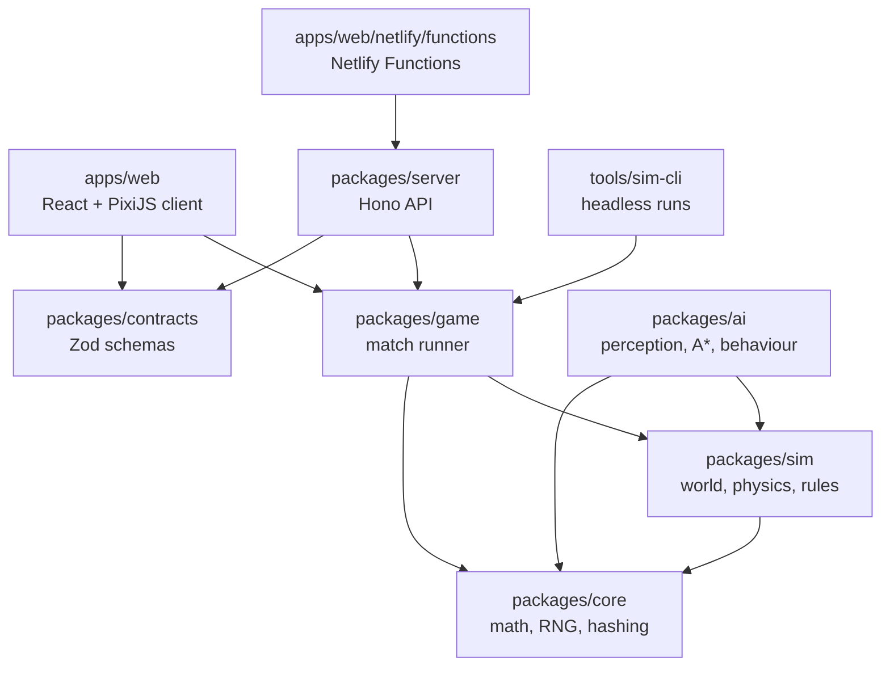

# Tank Arena

[](https://github.com/kjartanandersen/tank-arena/actions/workflows/ci.yml)

A top-down 2D tank game in which you fight AI-controlled tanks in single-screen arenas, with ricocheting bullets and destructible walls. It's a full-stack TypeScript monorepo built around one idea: the game simulation is a **deterministic, pure TypeScript package**. The same code runs in the browser, in a headless CLI and on the server. That lets the server re-simulate a submitted run from its input log before the score reaches a leaderboard, and lets a replay be just a seed plus the player's inputs.

> **Status: early development.** Milestone 0 (the foundation) is done: the monorepo, CI and Netlify deployment work end to end, with a placeholder tank and a health-check API. Gameplay, AI and the backend come next. See the [roadmap](#roadmap).

## Quick start

**Prerequisites**

- Node 24 (see `.nvmrc`).
- pnpm 12 via Corepack (`corepack enable`). The exact version is pinned in `package.json`.
- On Windows, turn on Developer Mode: Netlify's local function bundling creates symlinks.

```bash
pnpm install
pnpm dev        # http://localhost:8080 serves the game, plus /api/* through Netlify Functions emulation
```

| Command        | What it does                                                                         |
| -------------- | ------------------------------------------------------------------------------------ |
| `pnpm dev`     | Vite dev server with Netlify Functions emulation                                     |
| `pnpm check`   | What CI runs: format check, lint, then typecheck, test and build across all packages |
| `pnpm test`    | All test suites (Turborepo, cached)                                                  |
| `pnpm sim 600` | Runs a headless match for 600 ticks in Node, with no build step                      |
| `pnpm format`  | Formats the repo with Prettier                                                       |

## How it's built



| Package                              | Role                                                                                                                                                       |
| ------------------------------------ | ---------------------------------------------------------------------------------------------------------------------------------------------------------- |
| `packages/core`, `sim`, `ai`, `game` | The deterministic simulation. Zero runtime dependencies, with no DOM, Node, clock or `Math.random` ([ADR 0001](docs/adr/0001-deterministic-simulation.md)) |
| `packages/contracts`                 | Zod schemas shared by client and server, so API payloads are validated on both ends                                                                        |
| `packages/server`                    | The Hono API, testable on its own; Netlify Functions are thin wrappers around it                                                                           |
| `apps/web`                           | The deployed Netlify site: React UI, PixiJS rendering, a fixed-timestep game loop outside React, and the function entry points                             |
| `tools/sim-cli`                      | Headless simulation runs (later: AI tournaments, replay verification, benchmarks)                                                                          |

**Engineering notes**

- **No build step for libraries.** Internal packages export their TypeScript source. Vite, Vitest, `tsc`, Netlify's esbuild and Node 24's built-in type stripping each compile it where it's used. To make that work everywhere:
  - relative imports carry `.ts` extensions;
  - only erasable TypeScript is allowed (`erasableSyntaxOnly`, so no enums);
  - type-only imports use `import type`.
- **Determinism is enforced, not just intended.** An ESLint profile bans clocks, `Math.random`, engine-dependent `Math.*` functions and `**` inside the simulation packages. A layering rule stops lower layers from importing higher ones.
- **Netlify bundling is tested in CI.** `apps/web/netlify/bundle.test.ts` runs Netlify's own function bundler and calls the result in a clean Node process. Deploy-only failures, such as a missing runtime dependency, therefore fail CI instead of production.
- **Cache-correct Turborepo.** A "transit" task makes a change in `core` invalidate cached typecheck and test results for everything that depends on it, while tasks still run in parallel.

## Decision records

- [ADR 0001: Deterministic simulation](docs/adr/0001-deterministic-simulation.md)
